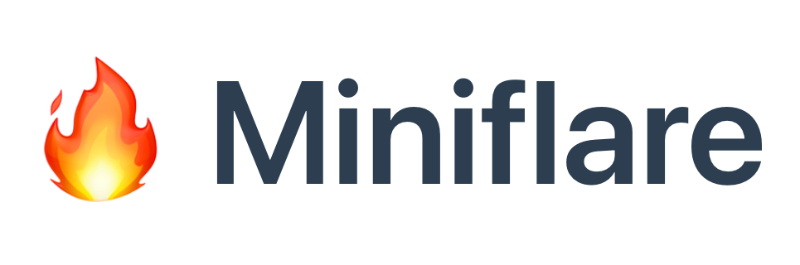

# Worker Environments

* Table of Contents
{:toc .large-only}

## Origin

Worker Environments are an **adaptation** of the [Service Workers API][sw], which is a browser standard for offline web applications. To give web developers more freedom over offline experiences, the specification includes a (minimal) HTTP server. Since it was published, **other vendors have implemented this API** for servers that run in the cloud — or on the edge in the case of [Cloudflare Workers][cw].

Typically, they also implement other browser APIs such as Fetch, Streams, and Web Cryptography, making their global scope similar to that of a Service Worker. We call them _Worker Environments_ or _Worker Contexts_. 

To see which vendors and APIs are available, check out the [State of Worker Environments](#state-of-worker-environments){:.heading} below. 

```js
self.addEventListener('fetch', event => {
  event.respondWith(new Response('Hello World', {
    headers: { 'Content-Type': 'text/plain' }
  }));
})
```
{:.larger}

Example of a minimal HTTP server using Service Workers API
{:.figcaption style="margin-top:-1rem"}

*Since originally writing this, both Deno and Cloudflare Workers have dropped support for the pattern shown above.*
*While the `Request` and `Response` classes remain, the global `fetch` event and `respondWith` method do not.*
*The reasons are difficult to ascertain, but it seems it was deemed too confusing for beginners.*
{:.note title="Deprecation Notice"}


## State of Worker Environments
Last modified at: {{ page.last_modified_at | date:"%b %d %Y" }}
{:.heading.post-date}

There are currently two production quality Worker Environments. There are multiple offline, testing, and development implementations.
[Cloudflare Workers][cw] was the first, and is the most battle-tested Worker Environment. 
[Deno Deploy][dd] is a close second.
{:.note title="Summary"}


[{:.fl style="max-width:22.5rem;margin-top: 1rem"}][cw]{:.no-mark title="Cloudflare Workers"}
[{:.fl style="max-height:6.5rem;margin:.75rem"}][dd]{:.no-mark title="Deno Deploy"}
[{:.fl style="max-height:6.5rem;margin-top:.75rem"}][mfl]{:.no-mark title="Miniflare"}
[{:.fl style="max-height:6rem; margin:1rem"}][cdv]{:.no-mark title="cfworker/dev"}
{:.break-layout}

***
{:.clearfix}

<br/>

|                         | [Service Workers][sw] | [Cloudflare Workers][cw] | [Deno CLI][dn] | [Deno Deploy][dd] | [Miniflare][mfl] | [cfworker/dev][cdv] | [cloudflare-<br/>worker-local][wlc] |
|:------------------------|:-:|:-:|:-:|:-:|:-:|:-:|:-:|
| Domain                  | Browser               | Edge                     | Server         | Edge              | Testing, Dev     | Testing, Dev        | Testing, Dev                        |
| Open Source             | ✅ | 🚫 | ✅ | [ℹ️][dd] | ✅ | ✅ | ✅ |
| 1.0                     | ✅ | ✅ | ✅ |  ✅      | ✅ | ✅ | ✅ |

[c1]: https://github.com/dollarshaveclub/cloudworker#%EF%B8%8F-cloudworker-is-no-longer-actively-maintained-at-dollar-shave-club-if-youre-interested-in-volunteering-to-help-please-open-an-issue-%EF%B8%8F
[c2]: https://deno.com/deploy
[dd]: https://deno.com/deploy
[mfl]: https://miniflare.dev

### Legend

✅
: Supported
 
ℹ️
: Partial support / attention required

🔜
: Implementation in progress

👨‍💻
: Supported via 3rd party library / polyfill

❓
: Support to be determined

🚫
: Not supported

🔙
: Backwards compatibility only

💀
: Support dropped
{:.legend}


### Browser APIs

The center piece of any Worker Environment is an implementation of the global `fetch` event. 
Implementations of other browser APIs are necessary for bridging the gap between different worker environments.

|                         | Service Workers | Cloudflare Workers | Deno CLI | Deno Deploy | Miniflare | cfworker/dev | cloudflare-<br/>worker-local |
|:------------------------|:-:|:-:|:-:|:-:|:-:|:-:|:-:|
| `fetch` event           |  ✅      | [🔙][xi] | [👨‍💻][xb] |  ❓      |  ✅      |  ✅      |  ✅      |
| URL API                 |  ✅      | [ℹ️][x5] |  ✅      |  ✅      |  ✅      |  ✅      |  ✅      |
| Fetch API               |  ✅      |  ✅      |  ✅      |  ✅      |  ✅      |  ✅      |  ✅      |
| Abort Controller/Signal |  ✅      |  ✅      |  ✅      |  ✅      |  ✅      | [👨‍💻][x1] | [👨‍💻][x1] |
| URL Pattern API         | [ℹ️][xf] | [👨‍💻][xh] |  ✅      |  ✅      | [👨‍💻][xh] | [👨‍💻][xh] | [👨‍💻][xh] |
| Encoding API            |  ✅      |  ✅      |  ✅      |  ✅      |  ✅      |  ✅      |  ✅      |
| Streams API             | [ℹ️][x2] | [ℹ️][x4] |  ✅      |  ✅      | [ℹ️][x4] |  ℹ️      |  🚫      |
| Encoding Streams        | [ℹ️][x0] |  🚫      |  ✅      |  ✅      |  🚫      |  🚫      |  🚫      | 
| Compression Streams     | [ℹ️][xo] |  🚫      |  ✅      |  ❓      |  🚫      |  🚫      |  🚫      |
| Web Cryptography API    |  ✅      |  ✅      |  ✅      |  ✅      |  ✅      |  ✅      |  ✅      |
| `crypto.randomUUID()`   | [ℹ️][xg] |  ✅      |  ✅      |  ✅      |  ✅      |  ❓      |  ❓      |
| Cache API               |  ✅      | [ℹ️][xa] |  ❓      | [🔜][xn] | [ℹ️][xd] |  ✅      |  ℹ️      |
| WebSocket API           |  ✅      | [ℹ️][xc] |  ✅      |  ✅      | [ℹ️][xe] |  🚫      |  🚫      |
| [Web Socket Stream][wss]|  ❓      |  ❓      | [🔜][xm] |  ❓      |  ❓      |  🚫      |  🚫      |
| Location API            |  ✅      | [👨‍💻][x9]️ |  ✅      |  ✅      | [👨‍💻][x9]️ | [👨‍💻][x9] | [👨‍💻][x9] |
| `queueMicrotask`        |  ℹ️      |  ✅      |  ✅      |  ✅      |  ✅      |  ❓      |  ❓      |
| `structuredClone`       |  ℹ️      |  ✅      |  ✅      |  ✅      |  ✅      |  ❓      |  ❓      | 
| IndexedDB               |  ✅      |  🚫      | [❓][x3] | [❓][x3] |  🚫      |  🚫      |  🚫      |
| EventTarget and Event   |  ✅      |  ✅      |  ✅      |  ✅      |  ✅      |  ❓      |  ❓      |
| Web Workers API         |  ✅      |  🚫      |  ✅      |  ✅      |  🚫      |  ❓      |  ❓      |
| Message Channel         |  ✅      |  🚫      |  ✅      |  ✅      |  🚫      |  🚫      |  🚫      |
| Broadcast Channel       | [ℹ️][xj] |  🚫      | [🔜][xl] | [ℹ️][xk] |  🚫      |  🚫      |  🚫      |
|:------------------------|:-:|:-:|:-:|:-:|:-:|:-:|:-:|
|                         | Service Workers | Cloudflare Workers | Deno CLI | Deno Deploy | Miniflare | cfworker/dev | cloudflare-<br/>worker-local |

[wss]: https://web.dev/websocketstream/

[x1]: https://github.com/mo/abortcontroller-polyfill
[x2]: https://caniuse.com/streams
[x3]: https://github.com/denoland/deno/issues/1699
[x4]: https://developers.cloudflare.com/workers/learning/using-streams
[x5]: https://developers.cloudflare.com/workers/runtime-apis/web-standards#url-api
[x6]: https://github.com/denoland/deno/issues/5957#issuecomment-722568905
[x7]: https://github.com/denoland/deno/issues/8824#:~:Re-align%20Streams%20to%20current%20standards
[x8]: https://github.com/denoland/deno/issues/1891
[x9]: https://github.com/worker-tools/location-polyfill
[x0]: https://caniuse.com/?search=text(en%7Cde)coderstream
[xa]: https://developers.cloudflare.com/workers/learning/how-the-cache-works
[xb]: https://github.com/worker-tools/deno-fetch-event-adapter
[xc]: https://blog.cloudflare.com/introducing-workers-durable-objects/#can-durable-objects-serve-websockets
[xd]: https://miniflare.dev/cache.html
[xe]: https://miniflare.dev/web-sockets.html
[xf]: https://caniuse.com/mdn-api_urlpattern
[xg]: https://caniuse.com/mdn-api_crypto_randomuuid
[xh]: https://github.com/kenchris/urlpattern-polyfill
[xi]: https://developers.cloudflare.com/workers/learning/migrating-to-module-workers#migrating-a-simple-worker
[xj]: https://caniuse.com/broadcastchannel
[xk]: https://deno.com/deploy/docs/runtime-broadcast-channel
[xl]: https://github.com/denoland/deno/issues/13214#issuecomment-1002551857
[xm]: https://doc.deno.land/deno/unstable/~/WebSocketStream
[xn]: https://deno.com/deploy/docs/runtime-api#future-support
[xo]: https://caniuse.com/mdn-api_compressionstream


### Working Drafts
The APIs below are either abandoned or do not have buy-in from major browser vendors. However, they can still be reasonable targets for 3rd party libraries, such as KV stores or cookie middleware.

|                         | Service Workers | Cloudflare Workers | Deno CLI | Deno Deploy | Miniflare | cfworker/dev | cloudflare-<br/>worker-local |
|:------------------------|:-:|:-:|:-:|:-:|:-:|:-:|:-:|
| [KV Storage API][kva]   | [👨‍💻][w1] | [👨‍💻][w2] | [👨‍💻][w6] | [👨‍💻][w6] | [👨‍💻][w2] | [👨‍💻][w6] | [👨‍💻][w2] |
| [Cookie Store API][csa] | [ℹ️][w3] | [👨‍💻][w4] | [👨‍💻][w4] | [👨‍💻][w4] | [👨‍💻][w4] | [👨‍💻][w4] | [👨‍💻][w4] |

[kva]: https://github.com/WICG/kv-storage
[csa]: https://developer.mozilla.org/en-US/docs/Web/API/Cookie_Store_API

[w1]: https://github.com/GoogleChromeLabs/kv-storage-polyfill
[w2]: https://github.com/worker-tools/cloudflare-kv-storage
[w3]: https://caniuse.com/cookie-store-api
[w4]: https://github.com/worker-tools/request-cookie-store
[w5]: https://github.com/denoland/deno/issues/1923
[w6]: https://github.com/worker-tools/deno-kv-storage


### Non-Standard APIs
These are useful APIs provided by one or more Worker Environment that aren't on any standards track (including abandoned). 

|                             | Service Workers | Cloudflare Workers | Deno CLI | Deno Deploy | Miniflare | cfworker/dev | cloudflare-<br/>worker-local |
|:----------------------------|:-:|:-:|:-:|:-:|:-:|:-:|:-:|
| [`scheduled` event][u1]     |  🚫      |  ✅      |  🚫      |  🚫      |  ✅      | 🚫 |  🚫      |
| [HTMLRewriter][u2]          | [👨‍💻][u7] |  ✅      | [👨‍💻][u7] | [👨‍💻][u7] | [ℹ️][u8] | ✅ | [👨‍💻][u7] |
| [KV][u3]                    |  🚫      |  ✅      |  🚫      |  🚫      |  ✅      | ✅ | [ℹ️][u6] |
| [Durable Objects][u4]       |  🚫      |  ✅      |  🚫      |  🚫      |  ✅      | 🚫 |  🚫      |
| [`crypto.DigestStream`][u9] |  🚫      |  ✅      |  🚫      |  🚫      |  ✅      | 🚫 |  🚫      |
| [Ed25519 via WebCrypto][ue] |  🚫      |  ✅      |  🚫      |  🚫      |  ✅      | 🚫 |  🚫      |

### General Capabilities, Non-Standard
These are some general capabilities provided by one or more Worker Environment that share similarities but aren't tied to a specific API.

|                             | Service Workers | Cloudflare Workers | Deno CLI | Deno Deploy | Miniflare | cfworker/dev | cloudflare-<br/>worker-local |
|:----------------------------|:-:|:-:|:-:|:-:|:-:|:-:|:-:|
| File system access          |  🚫      |  🚫      |  ✅      | [ℹ️][uf] |  🚫      | 🚫 |  🚫      |
| Connect TCP                 |  🚫      | [🔜][ua] | [✅][ub] | [✅][uc] | [🔜][ua] | 🚫 |  🚫      |
| Connect UDP                 |  🚫      | [🔜][ua] | [🔜][ud] | [🔜][ud] | [🔜][ua] | 🚫 |  🚫      |
| WebSockets (Server)         |  🚫      | [✅][uh] | [✅][ui] |  ❓      | [✅][uh] | 🚫 |  🚫      |
 

[u1]: https://developers.cloudflare.com/workers/runtime-apis/scheduled-event
[u2]: https://developers.cloudflare.com/workers/runtime-apis/html-rewriter
[u3]: https://developers.cloudflare.com/workers/runtime-apis/kv
[u4]: https://developers.cloudflare.com/workers/runtime-apis/durable-objects
[u5]: https://github.com/dollarshaveclub/cloudworker#workers-kv
[u6]: https://github.com/gja/cloudflare-worker-local#cloudflare-kv-store-emulation-using-minio-or-any-s3-compatible-service
[u7]: https://github.com/worker-tools/parsed-html-rewriter
[u8]: https://github.com/mrbbot/html-rewriter-wasm#caveats
[u9]: https://developers.cloudflare.com/workers/platform/changelog#2021-12-10
[ua]: https://blog.cloudflare.com/introducing-socket-workers/
[ub]: https://doc.deno.land/deno/stable/~/Deno.connect
[uc]: https://deno.com/deploy/docs/runtime-sockets
[ud]: https://doc.deno.land/deno/unstable/~/Deno.listenDatagram
[ue]: https://developers.cloudflare.com/workers/platform/changelog#2021-06-27
[uf]: https://deno.com/deploy/docs/runtime-fs
[ug]: https://developer.mozilla.org/en-US/docs/Web/API/Web_Periodic_Background_Synchronization_API
[uh]: https://developers.cloudflare.com/workers/runtime-apis/websockets
[ui]: https://deno.land/manual@v1.18.2/runtime/http_server_apis_low_level#serving-websockets


## Backend for Frontend
Worker Environments fulfill the original promise of NodeJS: To use one language and share code between client and server. In practice, this never came to be. Instead the APIs of node and browsers have diverged[^1]. Worker Environments are bringing them back together.  

This is good news for Frontend Developers in particular: The knowledge acquired for building (offline) web applications can now be applied to writing HTTP servers --- and so can the tools:

[^1]: Node and the browser have diverged due to a lack of browser APIs for many crucial components, including HTTP, streams, file access, and more more. A lot has changed since then. Standards have been written for all of these and more, often informed by the experience of using the node-equivalent.

### Frameworks
No HTTP Server is complete without a Web Framework for common tasks such as routing, sessions, authentication, and more. 
Unfortunately, Worker Environments do not have a framework at the level of polish that is common in Node.js, yet.

However, you can try [**cfworker/web**](https://github.com/cfworker/cfworker/blob/main/packages/web/README.md) which is a Web framework inspired by Koa and fastify.

You can also check out [**Worker Tools**][wt]{:.external}, a collection of tools and libraries that achieve many of the same goals as a web framework, built by yours truly.

For more tools and libraries that work on Cloudflare Workers, check out [Works on Workers](https://workers.cloudflare.com/works).

## Contributing

Are you aware of any other Worker Environments available or in development? Did you find any inaccuracies in the tables above? Open a PR in the [workers.js.org repository](https://github.com/worker-tools/workers.js.org)!


[sw]: https://w3c.github.io/ServiceWorker/
[cw]: https://workers.cloudflare.com
[dn]: https://deno.land
[dn]: https://deno.land
[dsc]: https://github.com/dollarshaveclub/cloudworker
[wt]: https://workers.tools/
[wlc]: https://github.com/gja/cloudflare-worker-local
[cdv]: https://github.com/cfworker/cfworker/tree/main/packages/dev

<br/>
<style>
  dl.legend {
    display: grid;
    grid-template-columns: repeat(auto-fill, 36px minmax(min(300px, 100%), 1fr));
    grid-gap: 0.5rem;
  }

  dl.legend dd {
    margin: 0;
  }
  table th:first-of-type {
      width: 220px;
  }
  table th:not(:first-of-type) {
      width: 180px;
  }
  table a::after { content: none!important; }
</style>
