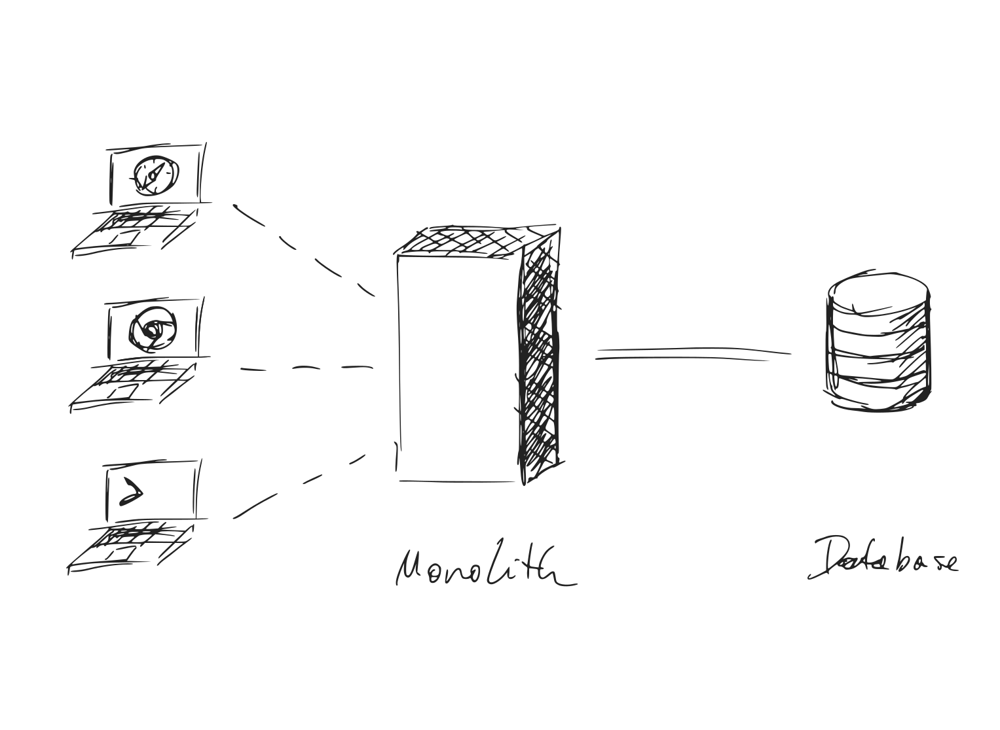
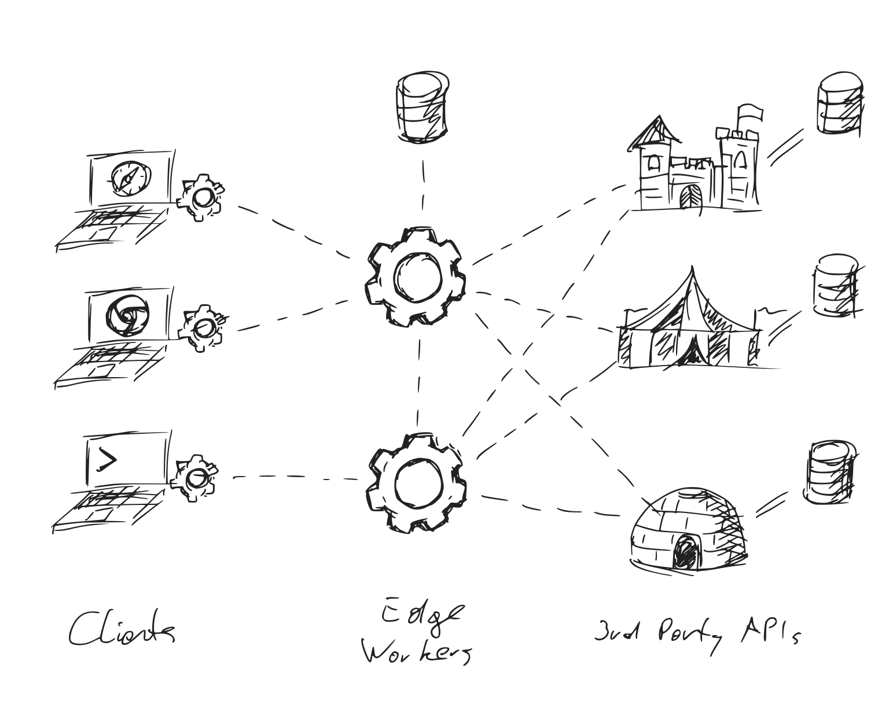

# Worker Environments

<picture class="app-button" style="display:block;text-align:center">
  <source srcset="assets/img/logo_d.svg" media="(prefers-color-scheme: dark)">
  
</picture>

Worker Environments are the new standard for writing HTTP servers in JavaScript.
{:.lead.centered style="max-width:560px;margin-left:auto;margin-right:auto"}

[Get Started](#state-of-worker-environments){:.btn.btn-primary}
[Contribute](#contributing){:.btn.btn-default style="font-weight:normal"}
{:.centered.mt2.mb4}

***

* Table of Contents
{:toc .large-only}

## Origin

<clap-button url="#origin" text-placement="bottom" nowave></clap-button>

Worker Environments are a **derivation of the [Server Workers API][1]**, which is a browser standard for offline web applications. To give developers more freedom over offline experiences, the specification includes a (minimal) HTTP server API. 
<!-- These are known as *Service Workers*. -->

Since it was published, **other vendors have adopted this API** for HTTP servers that run in the cloud — or on the edge in the case of [Cloudflare Workers][2]. Together with Service Workers, they are known as _Worker Environments_, or _Worker Contexts_.

## Frontend for Backend

<clap-button url="#frontend-for-backend" text-placement="bottom" nowave></clap-button>

Worker Environments fulfill the original promise of NodeJS: To use one language and share code between client and server. In practice, this never came to be. Instead the worlds of node and browsers have diverged[^1]. Worker Environments are bringing them back together.  

This is good news for Frontend Developers in particular: The knowledge ac- and re-quired for building offline web applications can now be applied to writing HTTP servers --- and vice-versa.

## The API Economy

<clap-button url="#the-api-economy" text-placement="bottom" nowave></clap-button>

Worker Environments are en extension of the API Economy: As more functionality moves into 3rd party providers sitting behind HTTP APIs, backends themselves become smaller. 

<picture style="display:block;text-align:center">
  <source srcset="assets/img/1_d.svg" media="(prefers-color-scheme:dark)">
  
</picture>

Figure 1: How web services used to be written.  
{:.figcaption}

In some cases, backends are reduced to storing credentials for 3rd party APIs. 
Having a fully-fledged NodeJS environment with native dependencies, FFI, etc. becomes increasingly unnecessary.
{:.mb2}

<!-- Over the past 2 decades, this model has changed significantly. Functionality that used to be part of the monolith, has been migrated into microservices (if company-internal), or 3rd party APIs (if shared between many companies). -->

<picture style="display:block;text-align:center">
  <source srcset="assets/img/2_d.svg" media="(prefers-color-scheme:dark)">
  
</picture>

Figure 2: The model for the next decade: Edge Workers sit between Service Workers and 3rd Party APIs.   
{:.figcaption}

Taking this model to it's logical conclusion, backends shrink to the size of API brokers. Scriptable Worker Environments are more than capable of playing that role.

***

## State of Worker Environments

<clap-button url="#state-of-worker-environments" text-placement="bottom" nowave></clap-button>

<!-- Are We Worker Environment Yet? -->

There is currently 1 (one) fully-featured Worker Environment and 1 (one) alternative being implemented.
{:.note title="Summary"}

 

[{:.fl style="max-width:23rem;margin: 1rem"}][2]{:.no-mark title="Cloudflare Workers"}
[{:.fl style="max-height:8rem"}][3]{:.no-mark title="Deno"}

***
{:.clearfix}

 

| API                     | Service Workers | Cloudflare Workers | Deno Workers |
|:------------------------|:---------------:|:------------------:|:------------:|
| Deployment Domain       | Browser | Edge | Server |
| Open Source             | ✅ | 🚫 | ✅ |
| 1.0                     | ✅ | ✅ | 🔜 |
{:.stretch-table}

### Browser APIs

The center piece of any Worker Environment is an implementation of the global `fetch` event. 
Implementations of other browser APIs are necessary for bridging the gap between different worker environments.

| API                     | Service Workers | Cloudflare Workers | Deno Workers |
|:------------------------|:---------------:|:------------------:|:------------:|
| `fetch` event           | ✅ | ✅ | [🔜][x6]{:.no-mark} |
| `install` event         | ✅ | 🚫 | ❓ |
| `activate` event        | ✅ | 🚫 | ❓ |
| URL API                 | ✅ | [ℹ️][x5]{:.no-mark} | ✅ |
| Fetch API               | ✅ | ✅ | ✅ |
| Abort Controller        | ✅ | [👨‍💻][x1]{:.no-mark} | ✅ |
| Encoding API            | ✅ | ✅ | ✅ |
| Streams API             | [ℹ️][x2]{:.no-mark} | [ℹ️][x4]{:.no-mark} | [🔜][x7]{:.no-mark} |
| Encoding Streams        | ℹ️ | 🚫 | 🚫 |
| Web Cryptography API    | ✅ | ✅ | [🔜][x8]{:.no-mark} |
| Cache API               | ✅ | ℹ️ | 🚫 |
| WebSockets              | ✅ | ℹ️ | ✅ |
| Timers                  | ✅ | ✅ | ✅ |
| IndexedDB               | ✅ | 🚫 | [🚫][x3]{:.no-mark} |
{:.stretch-table}

[x1]: https://github.com/benlesh/abort-controller-polyfill
[x2]: https://caniuse.com/streams
[x3]: https://github.com/denoland/deno/issues/1699
[x4]: https://developers.cloudflare.com/workers/learning/using-streams
[x5]: https://developers.cloudflare.com/workers/runtime-apis/web-standards#url-api
[x6]: https://github.com/denoland/deno/issues/5957#issuecomment-722568905
[x7]: https://github.com/denoland/deno/issues/8824#:~:Re-align%20Streams%20to%20current%20standards
[x8]: https://github.com/denoland/deno/issues/1891

### Working Drafts
<!-- Technically most of the APIs mentioned above are still working drafts. However, they are well supported in current browsers and Worker Environments (as outlined above).  -->
The APIs below are either abandoned or do not have buy-in from major browser vendors. However, they can still be reasonable targets for 3rd party libraries, such as KV stores or cookie middleware.

| API                     | Service Workers | Cloudflare Workers | Deno Workers |
|:------------------------|:---------------:|:------------------:|:------------:|
| KV Storage API          | [👨‍💻][w1]{:.no-mark} | [👨‍💻][w2]{:.no-mark} | [🚫][w5]{:.no-mark} |
| Cookie Store API        | [ℹ️][w3]{:.no-mark} | [👨‍💻][w4]{:.no-mark} | [👨‍💻][w4]{:.no-mark} |
{:.stretch-table}

[w1]: https://github.com/GoogleChromeLabs/kv-storage-polyfill
[w2]: https://github.com/worker-utils/cloudflare-kv-storage
[w3]: https://caniuse.com/mdn-api_cookiestore
[w4]: https://github.com/worker-utils/request-cookie-store
[w5]: https://github.com/denoland/deno/issues/1923

### Non-Standard APIs
These are useful APIs provided by one or more Worker Environment that aren't on any standards track (including abandoned). 

| API                     | Service Workers | Cloudflare Workers | Deno Workers |
|:------------------------|:---------------:|:------------------:|:------------:|
| `scheduled` event       | 🚫 | ✅ | 🚫 |
| HTMLWriter              | 🚫 | ✅ | 🚫 |
| KV                      | 🚫 | ✅ | 🚫 |
| Durable Objects         | 🚫 | ✅ | 🚫 |
{:.stretch-table}

### Legend

✅
: Supported
 
ℹ️
: Partial support / attention required

🔜
: Implementation in progress

👨‍💻
: Supported via 3rd party library / polyfill

❓
: Support to be determined

🚫
: Not supported

### Frameworks
No HTTP Server is complete without a Web Framework for common tasks such as routing, sessions, authentication, and more. _Worker Environments do not have a complete package yet._ 

However, over at **[worker-utils.github.io](https://worker-utils.github.io)** we're building the libraries and tools necessary for the first generation of Worker-based web frameworks.

## Contributing

<clap-button url="#contributing" text-placement="bottom" nowave></clap-button>

Are you aware of any other Worker Environments available or in development? Did you find any inaccuracies in the tables above? Open a PR!

[1]: https://w3c.github.io/ServiceWorker/
[2]: https://workers.cloudflare.com
[3]: https://deno.land

[^1]: Node and the browser have diverged due to a lack of browser APIs for many crucial components, including HTTP, streams, file access, and more more. A lot has changed since then. Standards have been written for all of these and more, often informed by the experience of using the node-equivalent.

 

