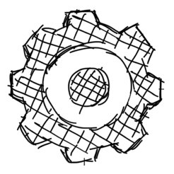
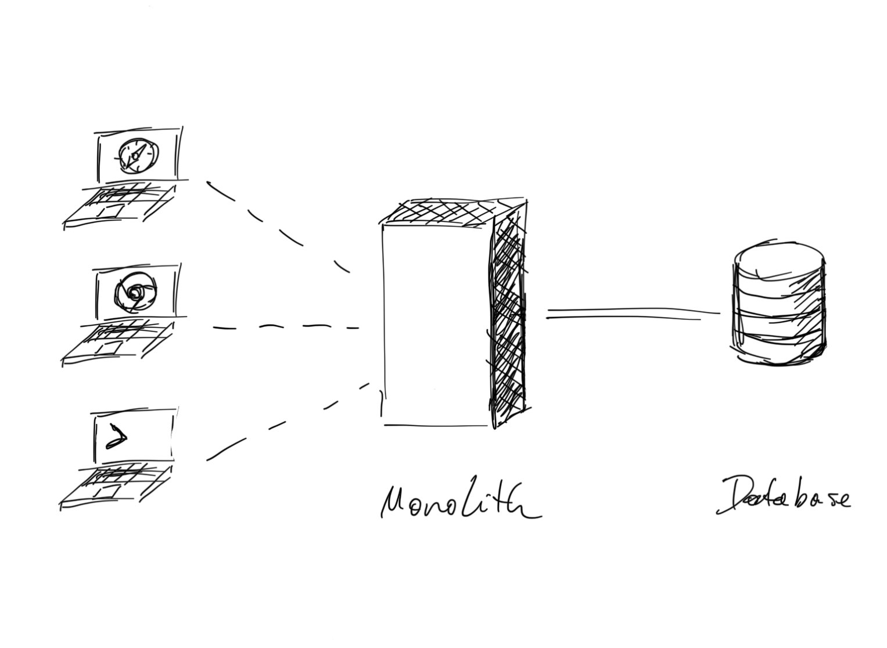
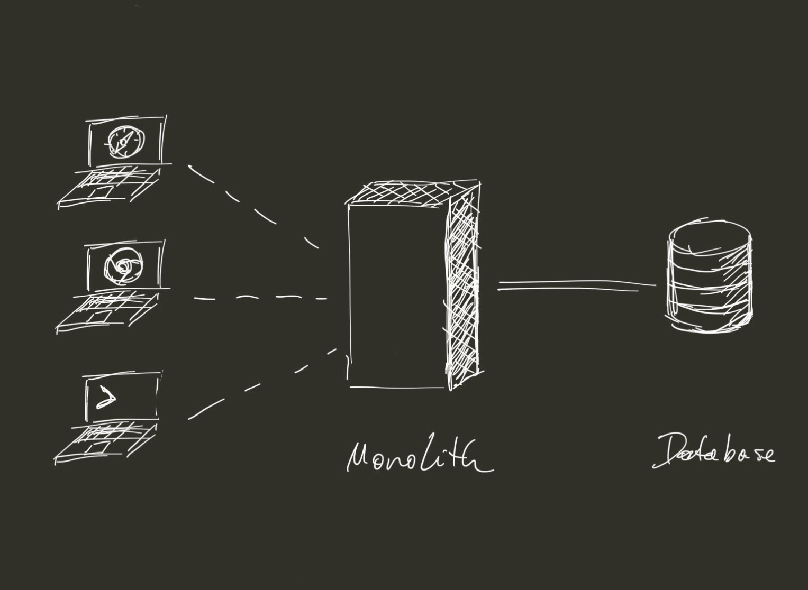
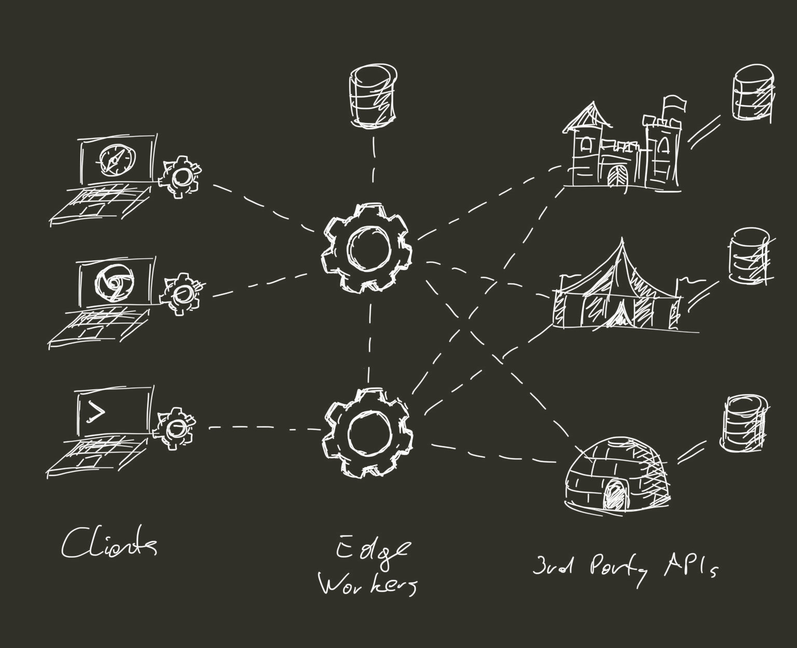

# Worker Environments

{:.app-button.lm-only style="height:10rem;margin:5rem calc(50% - 5rem)"}
{:.app-button.dm-only style="height:10rem;margin:5rem calc(50% - 5rem)"}

Worker Environments are the new standard for writing HTTP servers in JavaScript
{:.lead.centered style="max-width:560px;margin-left:auto;margin-right:auto"}

[Get Started](#state-of-worker-environments){:.btn.btn-primary}
[Contribute](#contributing){:.btn.btn-default style="font-weight:normal"}
{:.centered.mt2.mb4}

***
{:style="margin:5rem 0"}

* Table of Contents
{:toc .large-only}

## Origin

<clap-button url="#origin" text-placement="bottom" nowave></clap-button>

Worker Environments are a **derivation of the [Server Workers API][1]**, which is a browser standard for offline web applications. To give developers more freedom over offline experiences, the specification includes a (minimal) HTTP server API. 
<!-- These are known as *Service Workers*. -->

Since it was published, **other vendors have adopted this API** for HTTP servers that run in the cloud — or on the edge in the case of [Cloudflare Workers][2]. Together with Service Workers, they are known as _Worker Environments_, or _Worker Contexts_.

## Frontend for Backend

<clap-button url="#frontend-for-backend" text-placement="bottom" nowave></clap-button>

Worker Environments fulfill the original promise of NodeJS: To use one language and share code between client and server. In practice, this never came to be. Instead the worlds of node and browsers have diverged[^1]. Worker Environments are bringing them back together.  

This is good news for Frontend Developers in particular: The knowledge ac- and re-quired for building offline web applications can now be applied to writing HTTP servers --- and vice-versa.

## The API Economy

<clap-button url="#the-api-economy" text-placement="bottom" nowave></clap-button>

Worker Environments are en extension of the API Economy: As more functionality moves into 3rd party providers sitting behind HTTP APIs, backends themselves become smaller. 

{:.lm-only style="max-width:34rem"}
{:.dm-only style="max-width:34rem"}
{:.centered}

Figure 1: How web services used to be written.  
<!-- Specialization required for Monolith and Database programming. -->
{:.figcaption}

In some cases, backends are reduced to storing credentials for 3rd party APIs. 
Having a fully-fledged NodeJS environment with native dependencies, FFI, etc. becomes increasingly unnecessary.
{:.mb2}

<!-- Over the past 2 decades, this model has changed significantly. Functionality that used to be part of the monolith, has been migrated into microservices (if company-internal), or 3rd party APIs (if shared between many companies). -->

{:.lm-only style="max-width:34rem"}
{:.dm-only style="max-width:34rem"}
{:.centered}

Figure 2: The model for the next decade: Edge Workers sit between Service Workers and 3rd Party APIs.   
<!-- Specialization required within 3rd party providers. -->
{:.figcaption}

Taking this model to it's logical conclusion, backends shrink to the size of API brokers. Scriptable Worker Environments are more than capable of playing that role.

***
{:style="margin: 4rem 0"}

## State of Worker Environments

<clap-button url="#state-of-worker-environments" text-placement="bottom" nowave></clap-button>

<!-- Are We Worker Environment Yet? -->

There is currently 1 (one) fully-featured Worker Environment and 1 (one) alternative being implemented.
{:.note title="Summary"}

<!-- ### Cloudflare Workers -->
<!-- <svg viewBox="0 0 1430 375"><title>Cloudflare Workers logo (horizontal combination mark)</title><defs><linearGradient id="CloudflareWorkersLogoCombinationMarkHorizontal--gradient-a" x1="50%" x2="25.7%" y1="100%" y2="8.7%"><stop offset="0%" stop-color="#eb6f07"></stop><stop offset="100%" stop-color="#fab743"></stop></linearGradient><linearGradient id="CloudflareWorkersLogoCombinationMarkHorizontal--gradient-b" x1="81%" x2="40.5%" y1="83.7%" y2="29.5%"><stop offset="0%" stop-color="#d96504"></stop><stop offset="100%" stop-color="#d96504" stop-opacity="0"></stop></linearGradient><linearGradient id="CloudflareWorkersLogoCombinationMarkHorizontal--gradient-c" x1="42%" x2="84%" y1="8.7%" y2="79.9%"><stop offset="0%" stop-color="#eb6f07"></stop><stop offset="100%" stop-color="#eb720a" stop-opacity="0"></stop></linearGradient><linearGradient id="CloudflareWorkersLogoCombinationMarkHorizontal--gradient-d" x1="50%" x2="25.7%" y1="100%" y2="8.7%"><stop offset="0%" stop-color="#ee6f05"></stop><stop offset="100%" stop-color="#fab743"></stop></linearGradient><linearGradient id="CloudflareWorkersLogoCombinationMarkHorizontal--gradient-e" x1="-33.2%" x2="91.7%" y1="100%" y2="0%"><stop offset="0%" stop-color="#d96504" stop-opacity=".8"></stop><stop offset="49.8%" stop-color="#d96504" stop-opacity=".2"></stop><stop offset="100%" stop-color="#d96504" stop-opacity="0"></stop></linearGradient><linearGradient id="CloudflareWorkersLogoCombinationMarkHorizontal--gradient-f" x1="50%" x2="25.7%" y1="100%" y2="8.7%"><stop offset="0%" stop-color="#ffa95f"></stop><stop offset="100%" stop-color="#ffebc8"></stop></linearGradient><linearGradient id="CloudflareWorkersLogoCombinationMarkHorizontal--gradient-g" x1="8.1%" x2="96.5%" y1="1.1%" y2="48.8%"><stop offset="0%" stop-color="#fff" stop-opacity=".5"></stop><stop offset="100%" stop-color="#fff" stop-opacity=".1"></stop></linearGradient><linearGradient id="CloudflareWorkersLogoCombinationMarkHorizontal--gradient-h" x1="-13.7%" y1="104.2%" y2="46.2%"><stop offset="0%" stop-color="#fff" stop-opacity=".5"></stop><stop offset="100%" stop-color="#fff" stop-opacity=".1"></stop></linearGradient></defs><path class="CloudflareWorkersLogoCombinationMark--workers-wordmark" fill="#232324" d="M553.2 320.1L500.6 165h36.3l31.9 104.3 34.5-104.7h29L667 269.3 699 165h35.3l-52.5 155.1h-29.5l-34.8-100.8-34.7 100.8h-29.5zm246.2 1.5c-36.6 0-63.6-27-63.6-60.9v-.4c0-34 27.3-61.4 64-61.4 36.5 0 63.6 27 63.6 61v.4c0 33.8-27.3 61.3-64 61.3zm.4-28.8c19.1 0 30.6-14.7 30.6-32.1v-.4c0-17.4-12.6-32.6-31-32.6-19.2 0-30.6 14.7-30.6 32.1v.5c0 17.3 12.5 32.5 31 32.5zm87.8 26.2V201H921v23.8c6.8-16.2 17.8-26.8 37.6-26v35H957c-22.2 0-35.9 13.5-35.9 41.6V319h-33.4zm92 0V158.4h33.4V244l39.1-43h40l-44.8 46.5 46.4 71.5h-38.3l-30.8-48.2-11.6 12.3V319h-33.5zm180.6 2.6c-35.5 0-61.6-24.8-61.6-60.9v-.4c0-33.7 24-61.4 58.3-61.4 39.3 0 57.4 30.6 57.4 64 0 2.6-.2 5.7-.5 8.8h-82c3.3 15.2 13.8 23.1 28.8 23.1 11.2 0 19.4-3.5 28.6-12.1l19.1 17a59 59 0 0 1-48.1 22zm-28.9-70.8h50.4c-2-15-10.8-25-24.8-25-13.9 0-23 9.8-25.6 25zm107.8 68.2V201h33.5v23.8c6.8-16.2 17.8-26.8 37.6-26v35h-1.8c-22.2 0-35.8 13.5-35.8 41.6V319H1239zm133.4 2.2c-16.5 0-35-5.5-50.6-17.8l14.3-22a66.7 66.7 0 0 0 37.1 14c9.7 0 14.1-3.5 14.1-8.7v-.5c0-7.2-11.4-9.7-24.4-13.6-16.5-4.9-35.2-12.6-35.2-35.4v-.5c0-24 19.4-37.4 43.1-37.4 15 0 31.3 5 44 13.7l-12.7 23a69.9 69.9 0 0 0-32-11c-8 0-12.3 3.6-12.3 8.2v.4c0 6.6 11.3 9.7 24 14.1 16.5 5.5 35.7 13.4 35.7 35v.4c0 26.2-19.6 38.1-45.1 38.1z"></path><path class="CloudflareWorkersLogoCombinationMark--cloudflare-wordmark" fill="#656566" fill-rule="nonzero" d="M1210.9 78.9a6 6 0 1 1 0-12.1c3.3 0 6.1 2.7 6.1 6s-2.8 6-6.1 6zm0-11a4.9 4.9 0 0 0-4.9 5c0 2.6 2.2 4.8 4.9 4.8s4.9-2.2 4.9-4.9c0-2.6-2.2-4.8-4.9-4.8zm3.1 8.1h-1.4l-1.2-2.3h-1.6V76h-1.3v-6.6h3.2c1.4 0 2.3.9 2.3 2.1a2 2 0 0 1-1.4 2l1.4 2.5zm-2.4-3.5c.5 0 1-.3 1-1s-.4-1-1-1h-2v2h2zm-636.5-6.3h15.6v42.1H618v13.5H575V66.2zm58.9 28V94c0-16 13-29 30.3-29a29 29 0 0 1 30 28.8v.2c0 16-13 28.9-30.2 28.9A29 29 0 0 1 634 94.1zm44.6 0V94c0-8-5.8-15-14.4-15-8.5 0-14.2 6.8-14.2 14.9v.1c0 8 5.8 15 14.3 15 8.6 0 14.3-6.8 14.3-14.9zm34.9 3.2V66.2h15.8v31c0 8 4.1 11.7 10.3 11.7 6.2 0 10.3-3.6 10.3-11.4V66.2h15.8V97c0 18-10.3 25.8-26.3 25.8s-26-8-26-25.4zm76-31.2h21.6c20 0 31.7 11.4 31.7 27.5v.2c0 16-11.8 28-32 28h-21.3V66.1zm22 42c9.2 0 15.4-5.1 15.4-14.2V94c0-9-6.2-14.1-15.5-14.1h-6.3V108h6.3v.1zm54-42h44.9v13.5H881v9.5h26.6V102H881v19.8h-15.5V66.2zm66.5 0h15.5v42.1h27.2v13.5H932V66.2zm83.3-.4h15l24 56h-16.8l-4-9.9h-21.7l-4 10h-16.3l23.8-56.1zm13.7 34.1l-6.2-15.8-6.3 15.8h12.5zm45.2-33.7h26.6c8.6 0 14.5 2.2 18.3 6 3.3 3.2 5 7.5 5 13v.2c0 8.6-4.6 14.2-11.5 17L1126 122h-18l-11.4-16.8h-6.8v16.8h-15.6V66.2zm25.9 26.7c5.3 0 8.3-2.6 8.3-6.6v-.2c0-4.3-3.2-6.5-8.4-6.5h-10.3v13.3h10.4zm46.4-26.7h45v13H1162v8.5h26.9v12.2h-27v8.8h30.2v13.1h-45.5V66.2zM541 100.7a13.8 13.8 0 0 1-12.8 8.3c-8.5 0-14.3-7-14.3-15V94c0-8 5.7-15 14.2-15a14 14 0 0 1 13.3 9.3H558a29.2 29.2 0 0 0-29.6-23.1c-17.3 0-30.3 13-30.3 29v.1a29 29 0 0 0 30.1 28.8c14.8 0 26.4-9.5 29.4-22.2l-16.4-.1z"></path><path fill="url(#CloudflareWorkersLogoCombinationMarkHorizontal--gradient-a)" d="M107 5.4l49 88.4-45 81a26 26 0 0 0 0 25.3l45 81.2-49 88.4A52 52 0 0 1 85 349L7 213.5a52.2 52.2 0 0 1 0-52L85 26a52 52 0 0 1 22-20.6z"></path><path fill="url(#CloudflareWorkersLogoCombinationMarkHorizontal--gradient-b)" d="M111 174.9a26 26 0 0 0 0 25.2l45 81.2-49 88.4A52 52 0 0 1 85 349L7 213.5C.8 202.8 35.5 190 111 175z" opacity=".7"></path><path fill="url(#CloudflareWorkersLogoCombinationMarkHorizontal--gradient-c)" d="M112 14.3l44 79.5-7.3 12.7-38.8-65.7C98.7 22.5 81.6 32 60.2 69l3.2-5.5L85 26a52 52 0 0 1 21.8-20.6l5.1 8.9z" opacity=".5"></path><path fill="url(#CloudflareWorkersLogoCombinationMarkHorizontal--gradient-d)" d="M331 26l78 135.5c9.3 16 9.3 36 0 52L331 349a52 52 0 0 1-45 26h-78l97-174.9a26 26 0 0 0 0-25.2L208 0h78a52 52 0 0 1 45 26z"></path><path fill="url(#CloudflareWorkersLogoCombinationMarkHorizontal--gradient-e)" d="M282 374.4l-77 .7 93.2-175.8a27 27 0 0 0 0-25.4L205 0h17.6l97.8 173.1a27 27 0 0 1-.1 26.8 15624 15624 0 0 0-62.7 110c-19 33.4-10.8 54.9 24.4 64.5z"></path><path fill="url(#CloudflareWorkersLogoCombinationMarkHorizontal--gradient-f)" d="M130 375c-8 0-16-1.9-23-5.3l96.2-173.5c3-5.4 3-12 0-17.4L107 5.4A52 52 0 0 1 130 0h78l97 174.9a26 26 0 0 1 0 25.2L208 375h-78z"></path><path fill="url(#CloudflareWorkersLogoCombinationMarkHorizontal--gradient-g)" d="M298.2 178.8L199 0h9l97 174.9a26 26 0 0 1 0 25.2L208 375h-9l99.2-178.8c3-5.4 3-12 0-17.4z" opacity=".6"></path><path fill="url(#CloudflareWorkersLogoCombinationMarkHorizontal--gradient-h)" d="M203.2 178.8L107 5.4c3-1.6 6.6-2.8 10-3.8 21.2 38.1 52.5 95.9 94 173.3a26 26 0 0 1 0 25.2L115.5 373c-3.4-1-5.2-1.7-8.4-3.2l96-173.5c3-5.4 3-12 0-17.4z" opacity=".6"></path></svg> -->

<!-- ### Deno Workers -->
<!-- <svg xmlns="http://www.w3.org/2000/svg" version="1.0" width="1024.000000pt" height="1024.000000pt" viewBox="0 0 1024.000000 1024.000000" preserveAspectRatio="xMidYMid meet"><metadata>Created by potrace 1.15, written by Peter Selinger 2001-2017</metadata><g transform="translate(0.000000,1024.000000) scale(0.100000,-0.100000)" fill="#000000" stroke="none"><path d="M4720 9174 c-19 -2 -80 -9 -135 -14 -782 -82 -1552 -413 -2180 -939 -116 -96 -380 -360 -476 -476 -520 -621 -824 -1318 -936 -2143 -25 -183 -25 -801 0 -984 112 -825 416 -1522 936 -2143 96 -116 360 -380 476 -476 621 -520 1318 -824 2143 -936 183 -25 801 -25 984 0 825 112 1522 416 2143 936 116 96 380 360 476 476 520 621 824 1318 936 2143 25 183 25 801 0 984 -112 825 -416 1522 -936 2143 -96 116 -360 380 -476 476 -619 518 -1323 826 -2137 935 -88 12 -216 17 -453 19 -181 2 -346 1 -365 -1z m50 -432 c0 -117 8 -371 19 -612 6 -118 13 -287 16 -375 11 -312 44 -1131 49 -1204 l5 -73 -45 5 c-25 2 -48 8 -52 11 -3 4 -10 73 -14 154 -18 356 -77 1737 -83 1939 l-6 222 28 4 c15 2 40 5 56 6 l27 1 0 -78z m957 24 c1 -1 4 -303 7 -671 4 -369 9 -700 12 -736 3 -37 2 -69 -3 -71 -4 -3 -29 -3 -54 0 l-46 4 -7 291 c-4 161 -9 339 -11 397 -8 177 -15 778 -9 793 4 11 15 12 57 5 29 -6 53 -11 54 -12z m-2313 -335 c6 -9 53 -560 111 -1281 19 -245 38 -469 41 -497 5 -51 4 -53 -28 -73 -18 -11 -36 -20 -40 -20 -3 0 -9 26 -12 58 -14 130 -68 758 -106 1212 -22 267 -42 506 -45 532 -5 44 -4 48 22 62 32 17 50 20 57 7z m2753 -201 c28 -10 31 -15 37 -72 10 -100 7 -578 -4 -578 -29 0 -89 34 -94 53 -3 12 -6 154 -6 315 0 325 -4 306 67 282z m-1847 -47 c0 -27 7 -176 15 -333 8 -157 17 -356 21 -442 7 -174 9 -168 -58 -172 -33 -1 -33 -1 -35 49 -2 28 -7 115 -13 195 -5 80 -17 253 -25 385 -8 132 -18 263 -21 291 -6 50 -5 52 22 62 16 6 44 11 62 11 32 1 32 1 32 -46z m2774 -137 l34 -14 7 -134 c3 -73 5 -231 3 -350 l-3 -218 -42 21 -42 20 -3 332 c-2 183 -1 338 1 345 4 15 4 15 45 -2z m-1826 -131 c6 -6 20 -491 21 -737 l1 -148 -47 7 c-27 3 -49 6 -50 7 -3 2 -33 743 -33 815 l0 74 51 -6 c29 -4 54 -9 57 -12z m2303 -71 c12 -14 14 -233 17 -1441 3 -1387 3 -1423 -15 -1423 -11 0 -26 6 -35 13 -15 11 -17 132 -22 1317 -4 718 -9 1370 -12 1449 l-6 144 29 -21 c17 -12 36 -29 44 -38z m-897 -205 c5 -4 10 -61 11 -126 5 -221 6 -1576 1 -1580 -2 -2 -20 3 -40 11 l-36 15 0 851 0 850 28 -6 c15 -4 31 -10 36 -15z m-2760 -56 c3 -27 8 -88 11 -138 3 -49 10 -161 16 -248 12 -176 10 -187 -47 -187 -30 0 -34 3 -38 33 -10 59 -45 551 -40 559 5 7 57 25 81 27 6 1 14 -20 17 -46z m-1654 -255 c11 -106 33 -328 49 -493 17 -165 31 -305 31 -311 0 -12 -77 -50 -85 -42 -5 5 -105 890 -105 930 0 24 77 125 87 114 3 -2 13 -91 23 -198z m3921 -105 l29 -17 1 -216 c1 -118 3 -250 3 -293 2 -90 -9 -105 -63 -86 l-31 11 0 86 c0 48 -3 187 -7 310 l-6 222 23 0 c12 0 35 -8 51 -17z m-3482 -388 c18 -192 47 -516 66 -720 l34 -370 -39 -39 -38 -39 -7 79 c-4 44 -24 248 -45 454 -21 206 -51 505 -66 664 l-28 288 39 36 c35 33 39 34 46 16 4 -10 21 -176 38 -369z m-749 -121 c22 -197 80 -721 130 -1164 50 -443 97 -870 106 -950 8 -80 22 -201 30 -270 14 -117 14 -125 -2 -137 -24 -18 -34 -16 -34 5 0 9 -9 85 -20 167 -18 137 -48 369 -115 890 -14 105 -41 314 -60 465 -20 151 -49 376 -65 500 -16 124 -43 336 -60 473 -18 136 -29 257 -26 270 7 27 66 121 72 115 2 -3 22 -166 44 -364z m-306 -431 c15 -120 43 -339 62 -488 19 -148 43 -333 54 -410 l19 -140 -21 -18 c-12 -10 -24 -14 -28 -10 -4 4 -12 44 -18 88 -6 44 -43 301 -83 570 l-71 490 23 68 c12 37 25 67 28 67 4 0 19 -98 35 -217z m5490 131 c14 -14 16 -76 16 -535 l0 -519 -28 0 c-61 0 -60 -15 -64 553 l-3 517 32 0 c17 0 39 -7 47 -16z m-2189 -179 c226 -34 423 -97 618 -197 126 -65 186 -110 326 -244 208 -199 336 -373 456 -619 175 -358 243 -675 329 -1525 39 -381 90 -1072 101 -1355 3 -82 10 -217 16 -300 11 -176 24 -152 -131 -227 -215 -104 -422 -176 -695 -243 -334 -82 -550 -108 -880 -109 l-240 -1 2 115 c0 63 6 210 12 325 30 557 24 1260 -15 1650 -22 224 -65 496 -89 556 -5 13 18 24 117 58 181 63 338 142 362 181 43 74 -34 180 -132 180 -17 0 -68 -18 -115 -39 -224 -103 -673 -224 -932 -251 -179 -19 -457 -8 -650 27 -105 19 -293 90 -450 171 -181 94 -292 219 -325 367 -18 80 -13 240 10 330 25 99 95 243 159 327 285 375 873 700 1476 814 192 36 464 40 670 9z m3085 -31 c36 -15 40 -19 40 -53 2 -273 -4 -897 -9 -923 -1 -9 -53 -10 -75 -2 -14 5 -16 59 -16 500 0 316 4 494 10 494 5 0 28 -7 50 -16z m437 -549 l36 -15 -7 -828 c-8 -1055 -9 -1086 -47 -1177 -62 -149 -59 -179 -53 475 2 327 7 658 9 735 2 77 4 294 5 483 0 228 3 342 10 342 6 0 27 -7 47 -15z m-6014 -249 c6 -81 4 -89 -25 -153 l-32 -68 -12 100 c-19 160 -19 167 19 191 17 12 35 20 38 18 3 -2 9 -42 12 -88z m-618 -603 c9 -82 79 -626 115 -893 54 -413 58 -472 34 -447 -3 3 -26 142 -50 309 -156 1078 -155 1071 -142 1079 27 18 36 8 43 -48z m720 -458 c6 -25 35 -296 35 -329 0 -28 -36 -54 -52 -38 -5 5 -18 90 -28 188 -11 99 -22 202 -25 229 l-6 50 35 -40 c20 -22 38 -49 41 -60z m807 -377 c11 -10 18 -50 27 -158 15 -195 17 -180 -24 -180 -42 0 -41 -3 -55 173 -14 179 -14 177 13 177 13 0 30 -6 39 -12z m792 -15 c2 -10 7 -70 11 -133 3 -63 12 -205 20 -315 28 -404 29 -455 12 -455 -19 0 -21 15 -43 300 -8 118 -23 304 -33 413 -9 109 -15 200 -12 202 11 12 40 3 45 -12z m-1880 -192 c6 -9 44 -329 91 -766 14 -132 28 -259 31 -283 l5 -43 -25 16 c-19 13 -26 26 -26 49 0 63 -43 478 -76 732 -19 144 -34 271 -34 283 0 21 24 29 34 12z m5771 -418 l-7 -418 -25 -37 c-57 -84 -54 -100 -51 368 l2 429 37 38 c20 20 40 37 44 37 3 0 3 -188 0 -417z m-925 -663 c5 -581 4 -626 -12 -644 -10 -11 -19 -18 -22 -15 -7 8 -17 1275 -9 1282 4 4 14 6 23 5 13 -3 16 -74 20 -628z m-3266 398 c7 -62 32 -359 42 -499 6 -94 6 -97 -16 -104 -12 -4 -26 -3 -30 2 -7 7 -29 229 -56 571 l-7 82 31 0 c29 0 31 -2 36 -52z m-786 -350 c7 -7 12 -32 12 -57 0 -26 12 -161 25 -301 38 -383 41 -435 24 -425 -26 15 -49 38 -44 44 2 4 -2 54 -10 111 -7 58 -16 152 -20 210 -4 58 -13 164 -21 235 -19 175 -18 195 4 195 10 0 23 -5 30 -12z m473 -673 c3 -22 9 -104 13 -182 7 -150 4 -161 -37 -130 -12 9 -20 47 -32 161 -21 206 -22 198 17 194 29 -3 33 -7 39 -43z"/><path d="M3184 5756 c-104 -45 -112 -186 -14 -236 71 -36 143 -19 180 43 70 114 -44 246 -166 193z"/><path d="M3862 5660 c-96 -59 -96 -201 0 -260 95 -57 218 18 218 132 0 110 -126 184 -218 128z"/></g></svg> -->

| API                     | Service Workers | Cloudflare Workers | Deno Workers |
|:------------------------|:---------------:|:------------------:|:------------:|
| Deployment Domain       | Client | Edge | Server |
| Open Source             | ✅ | 🚫 | ✅ |
| 1.0                     | ✅ | ✅ | 🚫 |
{:.stretch-table}

### Browser APIs

The center piece of any Worker Environment is an implementation of the global `fetch` event. 
Implementations of other browser APIs are necessary for bridging the gap between different worker environments.

| API                     | Service Workers | Cloudflare Workers | Deno Workers |
|:------------------------|:---------------:|:------------------:|:------------:|
| `fetch` event           | ✅ | ✅ | 🔜 |
| `install` event         | ✅ | 🚫 | ❓ |
| `activate` event        | ✅ | 🚫 | ❓ |
| URL API                 | ✅ | ℹ️ | ✅ |
| Fetch API               | ✅ | ✅ | ✅ |
| Abort Controller        | ✅ | 👨‍💻 | ✅ |
| Encoding API            | ✅ | ✅ | ✅ |
| Streams API             | ℹ️ | ℹ️ | 🔜 |
| Encoding Streams        | ℹ️ | 🚫 | 🚫 |
| Web Cryptography API    | ✅ | ✅ | 🔜 |
| Cache API               | ✅ | ℹ️ | 🚫 |
| WebSockets              | ✅ | ℹ️ | ✅ |
| Timers                  | ✅ | ✅ | ✅ |
| IndexedDB               | ✅ | 🚫 | 🚫 |
{:.stretch-table}

### Working Drafts
<!-- Technically most of the APIs mentioned above are still working drafts. However, they are well supported in current browsers and Worker Environments (as outlined above).  -->
The APIs below are either abandoned or do not have buy-in from major browser vendors. However, they can still be reasonable targets for 3rd party libraries, such as KV stores or cookie middleware.

| API                     | Service Workers | Cloudflare Workers | Deno Workers |
|:------------------------|:---------------:|:------------------:|:------------:|
| KV Storage API          | 👨‍💻 | 👨‍💻 | ❓ |
| Cookie Store API        | ℹ️ | 👨‍💻 | ❓ |
{:.stretch-table}

### Non-Standard APIs
These are useful APIs provided by one or more Worker Environment that aren't on any standards track (including abandoned). 

| API                     | Service Workers | Cloudflare Workers | Deno Workers |
|:------------------------|:---------------:|:------------------:|:------------:|
| `scheduled` event       | 🚫 | ✅ | 🚫 |
| HTMLWriter              | 🚫 | ✅ | 🚫 |
| KV                      | 🚫 | ✅ | 🚫 |
| Durable Objects         | 🚫 | ✅ | 🚫 |
{:.stretch-table}

### Legend

✅
: Supported
 
ℹ️
: Partial support / attention required

🔜
: Implementation in progress

👨‍💻
: Supported via 3rd party library / polyfill

❓
: Support to be determined

🚫
: Not supported

### Frameworks
No HTTP Server is complete without a Web Framework for common tasks such as routing, sessions, authentication, and more. _Worker Environments do not have a complete package yet._ 

However, over at **[worker-utils.github.io](https://worker-utils.github.io)** we're building the libraries and tools necessary for the first generation of Worker-based web frameworks.

## Contributing

<clap-button url="#contributing" text-placement="bottom" nowave></clap-button>

Are you aware of any other Worker Environments available or in development? Did you find any inaccuracies in the tables above? Open a PR!

[1]: https://w3c.github.io/ServiceWorker/
[2]: https://workers.cloudflare.com

[^1]: Node and the browser have diverged due to a lack of browser APIs for many crucial components, including HTTP, streams, file access, and more more. A lot has changed since then. Standards have been written for all of these and more, often informed by the experience of using the node-equivalent.

