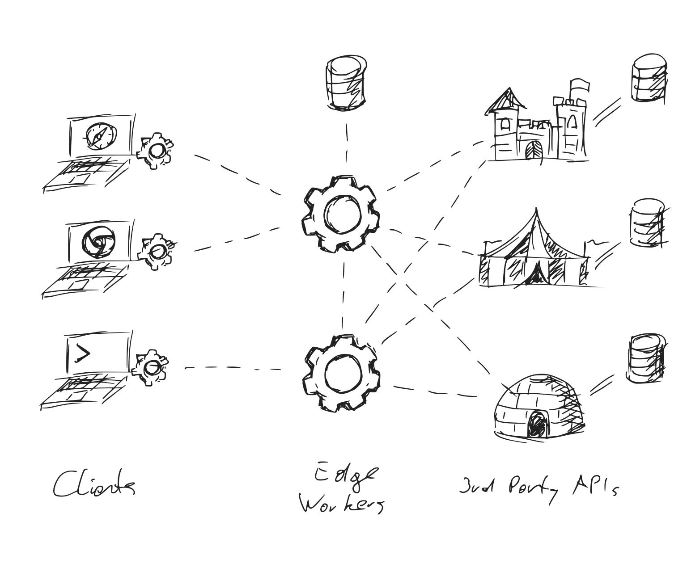

# Worker Environments

* Table of Contents
{:toc .large-only}

## Origin

Worker Environments are an **adaptation** of the [Service Workers API][sw], which is a browser standard for offline web applications. To give web developers more freedom over offline experiences, the specification includes a (minimal) HTTP server. Since it was published, **other vendors have implemented this API** for servers that run in the cloud — or on the edge in the case of [Cloudflare Workers][cw].

Typically, they also implement other browser APIs such as Fetch, Streams, and Web Cryptography, making their global scope similar to that of a Service Worker. We call them _Worker Environments_ or _Worker Contexts_. 

To see which vendors and APIs are available, check out the [State of Worker Environments](#state-of-worker-environments){:.heading} below. See the example below for a minimal HTTP server:

```js
self.addEventListener('fetch', event => {
  event.respondWith(new Response('Hello World'));
});
```
{:.larger}

Minimal example of a server written in a Worker Environment.
{:.figcaption}


## Backend for Frontend

Worker Environments fulfill the original promise of NodeJS: To use one language and share code between client and server. In practice, this never came to be. Instead the worlds of node and browsers have diverged[^1]. Worker Environments are bringing hem back together.  

This is good news for Frontend Developers in particular: The knowledge ac- and required for building offline web applications can now be applied to writing HTTP servers --- and so can [the tools][wt].

[^1]: Node and the browser have diverged due to a lack of browser APIs for many crucial components, including HTTP, streams, file access, and more more. A lot has changed since then. Standards have been written for all of these and more, often informed by the experience of using the node-equivalent.


## State of Worker Environments

There is currently 1 (one) fully-featured Worker Environment and 1 (one) alternative being implemented. There are 3 (three) offline testing and development implementations.
{:.note title="Summary"}

[Cloudflare Workers][cw] is the most complete Worker Environment. It is currently the only one implementing the global `fetch` event, bringing it on par with Service Workers. However, [Deno][dn] is expected to [follow shortly][x6].

<br/>

[{:.fl style="max-width:22.5rem;margin-top: 1rem"}][cw]{:.no-mark title="Cloudflare Workers"}
[{:.fl style="max-height:8rem"}][dn]{:.no-mark title="Deno"}
[{:.fl style="max-height:6rem; margin:1rem"}][cdv]{:.no-mark title="Deno"}
[{:.fl style="max-height:8rem"}][dsc]{:.no-mark title="Cloudworker"}
{:.break-layout}

***
{:.clearfix}

<br/>

|                         | [Service Workers][sw] | [Cloudflare Workers][cw] | [Deno][dn] | [cfworker/dev][cdv] | [Cloudworker][dsc] | [cloudflare-<br/>worker-local][wlc] |
|:------------------------|:---------------------:|:------------------------:|:----------:|:--------------:|:------------------:|:----------------------------------------:|
| Domain                  | Browser | Edge | Server | Testing, Dev | Testing, Dev | Testing, Dev |
| Open Source             | ✅ | 🚫 | ✅ | ✅ | ✅       | ✅ |
| 1.0                     | ✅ | ✅ | 🔜 | ✅ | [💀][c1] | ✅ |

[c1]: https://github.com/dollarshaveclub/cloudworker#%EF%B8%8F-cloudworker-is-no-longer-actively-maintained-at-dollar-shave-club-if-youre-interested-in-volunteering-to-help-please-open-an-issue-%EF%B8%8F

### Legend

✅
: Supported
 
ℹ️
: Partial support / attention required

🔜
: Implementation in progress

👨‍💻
: Supported via 3rd party library / polyfill

❓
: Support to be determined

🚫
: Not supported
{:.legend}


### Browser APIs

The center piece of any Worker Environment is an implementation of the global `fetch` event. 
Implementations of other browser APIs are necessary for bridging the gap between different worker environments.

| API                     | Service Workers | Cloudflare Workers | Deno | cfworker/dev | Cloudworker | cloudflare-<br/>worker-local |
|:------------------------|:---------------:|:------------------:|:----:|:------------:|:-----------:|:----------------------------:|
| `fetch` event           |  ✅      |  ✅      | [👨‍💻][xb] |  ✅      |  ✅      |  ✅      |
| `install` event         |  ✅      |  🚫      | [❓][x6] |  🚫      |  🚫      |  🚫      |
| `activate` event        |  ✅      |  🚫      | [❓][x6] |  🚫      |  🚫      |  🚫      |
| URL API                 |  ✅      | [ℹ️][x5] |  ✅      |  ✅      |  ✅      |  ✅      |
| Fetch API               |  ✅      |  ✅      |  ✅      |  ✅      |  ✅      |  ✅      |
| Abort Controller        |  ✅      | [👨‍💻][x1] |  ✅      | [👨‍💻][x1] | [👨‍💻][x1] | [👨‍💻][x1] |
| Encoding API            |  ✅      |  ✅      |  ✅      |  ✅      |  ✅      |  ✅      |
| Streams API             | [ℹ️][x2] | [ℹ️][x4] |  ✅      |  ✅      |  ℹ️      |  🚫      |
| Encoding Streams        | [ℹ️][x0] |  🚫      |  🚫      |  🚫      |  🚫      |  🚫      |
| Web Cryptography API    |  ✅      |  ✅      | [🔜][x8] |  ✅      |  ✅      |  ✅      |
| Cache API               |  ✅      | [ℹ️][xa] |  ❓      |  ✅      |  ℹ️      |  ℹ️      |
| WebSockets              |  ✅      |  🚫      |  ✅      |  🚫      |  🚫      |  🚫      |
| Location API            |  ✅      | [👨‍💻][x9]️ |  ✅      | [👨‍💻][x9] | [👨‍💻][x9] | [👨‍💻][x9] |
| Timers                  |  ✅      |  ✅      |  ✅      |  ✅      |  ✅      |  ✅      |
| IndexedDB               |  ✅      |  🚫      | [❓][x3] |  🚫      |  🚫      |  🚫      |

[x1]: https://github.com/mo/abortcontroller-polyfill
[x2]: https://caniuse.com/streams
[x3]: https://github.com/denoland/deno/issues/1699
[x4]: https://developers.cloudflare.com/workers/learning/using-streams
[x5]: https://developers.cloudflare.com/workers/runtime-apis/web-standards#url-api
[x6]: https://github.com/denoland/deno/issues/5957#issuecomment-722568905
[x7]: https://github.com/denoland/deno/issues/8824#:~:Re-align%20Streams%20to%20current%20standards
[x8]: https://github.com/denoland/deno/issues/1891
[x9]: https://github.com/worker-tools/location-polyfill
[x0]: https://caniuse.com/?search=text(en%7Cde)coderstream
[xa]: https://developers.cloudflare.com/workers/learning/how-the-cache-works
[xb]: https://github.com/worker-tools/deno-fetch-event-adapter


### Working Drafts
The APIs below are either abandoned or do not have buy-in from major browser vendors. However, they can still be reasonable targets for 3rd party libraries, such as KV stores or cookie middleware.

| API                     | Service Workers | Cloudflare Workers | Deno | cfworker/dev | Cloudworker | cloudflare-<br/>worker-local |
|:------------------------|:---------------:|:------------------:|:----:|:------------:|:-----------:|:----------------------------:|
| KV Storage API          | [👨‍💻][w1] | [👨‍💻][w2] | [👨‍💻][w6] | [👨‍💻][w6] | [👨‍💻][w2] | [👨‍💻][w2] |
| Cookie Store API        | [ℹ️][w3] | [👨‍💻][w4] | [👨‍💻][w4] | [👨‍💻][w4] | [👨‍💻][w4] | [👨‍💻][w4] |

[w1]: https://github.com/GoogleChromeLabs/kv-storage-polyfill
[w2]: https://github.com/worker-tools/cloudflare-kv-storage
[w3]: https://caniuse.com/cookie-store-api
[w4]: https://github.com/worker-tools/request-cookie-store
[w5]: https://github.com/denoland/deno/issues/1923
[w6]: https://github.com/worker-tools/deno-kv-storage


### Non-Standard APIs
These are useful APIs provided by one or more Worker Environment that aren't on any standards track (including abandoned). 

| API                     | Service Workers | Cloudflare Workers | Deno | cfworker/dev | Cloudworker | cloudflare-<br/>worker-local |
|:------------------------|:---------------:|:------------------:|:----:|:------------:|:-----------:|:----------------------------:|
| [`scheduled` event][u1] | 🚫       | ✅ | 🚫       | 🚫 | 🚫       | 🚫       |
| [HTMLRewriter][u2]      | [👨‍💻][u7] | ✅ | [👨‍💻][u7] | ✅ | [👨‍💻][u7] | [👨‍💻][u7] |
| [KV][u3]                | 🚫       | ✅ | 🚫       | ✅ | [ℹ️][u5] | [ℹ️][u6] |
| [Durable Objects][u4]   | 🚫       | 🔜 | 🚫       | 🚫 | 🚫       | 🚫       |

[u1]: https://developers.cloudflare.com/workers/runtime-apis/scheduled-event
[u2]: https://developers.cloudflare.com/workers/runtime-apis/html-rewriter
[u3]: https://developers.cloudflare.com/workers/runtime-apis/kv
[u4]: https://developers.cloudflare.com/workers/runtime-apis/durable-objects
[u5]: https://github.com/dollarshaveclub/cloudworker#workers-kv
[u6]: https://github.com/gja/cloudflare-worker-local#cloudflare-kv-store-emulation-using-minio-or-any-s3-compatible-service
[u7]: https://github.com/worker-tools/parsed-html-rewriter


### Frameworks
No HTTP Server is complete without a Web Framework for common tasks such as routing, sessions, authentication, and more. 

Worker Environments do not have a complete framework yet.
However, over at [**worker-tools.github.io**][wt]{:.external} we're building the libraries and tools necessary for the first generation of Worker-based web frameworks.

## Contributing

Are you aware of any other Worker Environments available or in development? Did you find any inaccuracies in the tables above? Open a PR in the [workers.js.org repository](https://github.com/worker-tools/workers.js.org)!

<br/>

***

## The API Economy
Worker Environments are not meant to provide everything traditional web servers did. They are better understood as the "glue" between browser clients and various API backends that have taken over much of their functionality. Consider the difference between traditional web architecture and the "API Economy":

<picture style="display:block;text-align:center">
  <source srcset="assets/img/1_d.svg" media="(prefers-color-scheme:dark)">
  
</picture>

How web services used to be written.  
{:.figcaption}

<picture style="display:block;text-align:center">
  <source srcset="assets/img/2_d.svg" media="(prefers-color-scheme:dark)">
  
</picture>

The model for the next decade: Edge Workers sit between Service Workers and 3rd Party APIs.   
{:.figcaption}

Taking this model to its logical conclusion, backends shrink to the size of API brokers. Scriptable Worker Environments are more than capable of playing that role.

[sw]: https://w3c.github.io/ServiceWorker/
[cw]: https://workers.cloudflare.com
[dn]: https://deno.land
[dsc]: https://github.com/dollarshaveclub/cloudworker
[wt]: https://worker-tools.github.io
[wlc]: https://github.com/gja/cloudflare-worker-local
[cdv]: https://github.com/cfworker/cfworker/tree/master/packages/dev

<br/>
<style>
  dl.legend {
    display: grid;
    grid-template-columns: repeat(auto-fill, 36px minmax(min(300px, 100%), 1fr));
    grid-gap: 0.5rem;
  }

  dl.legend dd {
    margin: 0;
  }
  table th:first-of-type {
      width: 220px;
  }
  table th:not(:first-of-type) {
      width: 180px;
  }
  table a::after { content: none!important; }
</style>
