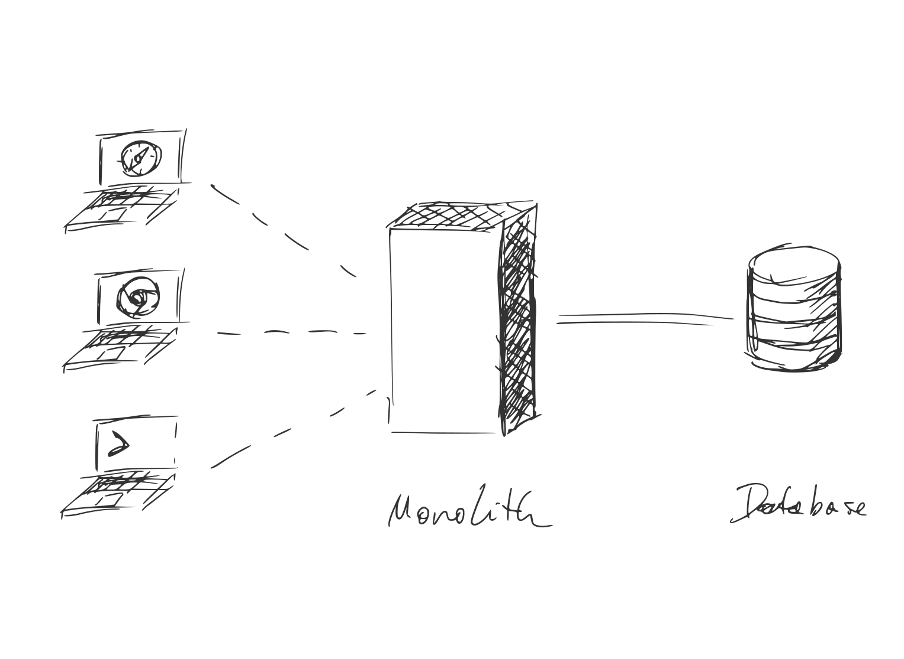

# Worker Environments

* Table of Contents
{:toc .large-only}

## Origin

Worker Environments are an **adaptation** of the [Server Workers API][1], which is a browser standard for offline web applications. To give web developers more freedom over offline experiences, it included a (minimal) HTTP server. Since it was published, **other vendors have implemented this API** for HTTP servers running in the cloud — or on the edge in the case of [Cloudflare Workers][cw].

Typically, they also implement other browser APIs such as Fetch, Streams, and Web Cryptography, making their global scope similar to that of a Service Worker. We call them _Worker Environments_ or _Worker Contexts_. 

To see which vendors and APIs are available, check out the [State of Worker Environments](#state-of-worker-environments){:.heading} below.


```js
self.addEventListener('fetch', event => {
  event.respondWith(new Response('Hello World'));
});
```
{:.larger}

Minimal example of a server written in a Worker Environment.
{:.figcaption}


## Backend for Frontend

Worker Environments fulfill the original promise of NodeJS: To use one language and share code between client and server. In practice, this never came to be. Instead the worlds of node and browsers have diverged[^1]. Worker Environments are bringing hem back together.  

This is good news for Frontend Developers in particular: The knowledge ac- and required for building offline web applications can now be applied to writing HTTP servers --- and so can [the tools][wt].


## The API Economy

Worker Environments are en extension of the API Economy: As more functionality moves into 3rd party providers sitting behind HTTP APIs, backends themselves become smaller. 

<picture style="display:block;text-align:center">
  <source srcset="assets/img/1_d.svg" media="(prefers-color-scheme:dark)">
  
</picture>

How web services used to be written.  
{:.figcaption}

In some cases, backends are reduced to storing credentials for 3rd party APIs. 
Having a fully-fledged NodeJS environment with native dependencies, FFI, etc. becomes increasingly unnecessary.
{:.mb2}

<picture style="display:block;text-align:center">
  <source srcset="assets/img/2_d.svg" media="(prefers-color-scheme:dark)">
  
</picture>

The model for the next decade: Edge Workers sit between Service Workers and 3rd Party APIs.   
{:.figcaption}

Taking this model to its logical conclusion, backends shrink to the size of API brokers. Scriptable Worker Environments are more than capable of playing that role.

***

## State of Worker Environments

There is currently 1 (one) fully-featured Worker Environment and 1 (one) alternative being implemented.
{:.note title="Summary"}

[Cloudflare Workers][cw] is the most complete Worker Environment. It is currently the only one implementing the global `fetch` event, bringing it on par with Service Workers. However, [Deno][dn] is expected to [follow shortly][x6].

<br/>

[{:.fl style="max-width:23rem;margin: 1rem"}][cw]{:.no-mark title="Cloudflare Workers"}
[{:.fl style="max-height:8rem"}][dn]{:.no-mark title="Deno"}

***
{:.clearfix}

<br/>

|                         | Service Workers | Cloudflare Workers | Deno |
|:------------------------|:---------------:|:------------------:|:----:|
| Deployment Domain       | Browser | Edge | Server |
| Open Source             | ✅ | 🚫 | ✅ |
| 1.0                     | ✅ | ✅ | 🔜 |
{:.stretch-table}


### Browser APIs

The center piece of any Worker Environment is an implementation of the global `fetch` event. 
Implementations of other browser APIs are necessary for bridging the gap between different worker environments.

| API                     | Service Workers | Cloudflare Workers | Deno |
|:------------------------|:---------------:|:------------------:|:----:|
| `fetch` event           | ✅ | ✅ | [🔜][x6]{:.no-mark} |
| `install` event         | ✅ | 🚫 | ❓ |
| `activate` event        | ✅ | 🚫 | ❓ |
| URL API                 | ✅ | [ℹ️][x5]{:.no-mark} | ✅ |
| Fetch API               | ✅ | ✅ | ✅ |
| Abort Controller        | ✅ | [👨‍💻][x1]{:.no-mark} | ✅ |
| Encoding API            | ✅ | ✅ | ✅ |
| Streams API             | [ℹ️][x2]{:.no-mark} | [ℹ️][x4]{:.no-mark} | ✅ |
| Web Cryptography API    | ✅ | ✅ | [🔜][x8]{:.no-mark} |
| Cache API               | ✅ | ℹ️ | 🚫 |
| WebSockets              | ✅ | ℹ️ | ✅ |
| Timers                  | ✅ | ✅ | ✅ |
| IndexedDB               | ✅ | 🚫 | [🚫][x3]{:.no-mark} |
{:.stretch-table}

[x1]: https://github.com/benlesh/abort-controller-polyfill
[x2]: https://caniuse.com/streams
[x3]: https://github.com/denoland/deno/issues/1699
[x4]: https://developers.cloudflare.com/workers/learning/using-streams
[x5]: https://developers.cloudflare.com/workers/runtime-apis/web-standards#url-api
[x6]: https://github.com/denoland/deno/issues/5957#issuecomment-722568905
[x7]: https://github.com/denoland/deno/issues/8824#:~:Re-align%20Streams%20to%20current%20standards
[x8]: https://github.com/denoland/deno/issues/1891


### Working Drafts
The APIs below are either abandoned or do not have buy-in from major browser vendors. However, they can still be reasonable targets for 3rd party libraries, such as KV stores or cookie middleware.

| API                     | Service Workers | Cloudflare Workers | Deno |
|:------------------------|:---------------:|:------------------:|:----:|
| KV Storage API          | [👨‍💻][w1]{:.no-mark} | [👨‍💻][w2]{:.no-mark} | [👨‍💻][w6]{:.no-mark} |
| Cookie Store API        | [ℹ️][w3]{:.no-mark} | [👨‍💻][w4]{:.no-mark} | [👨‍💻][w4]{:.no-mark} |
{:.stretch-table}

[w1]: https://github.com/GoogleChromeLabs/kv-storage-polyfill
[w2]: https://github.com/worker-tools/cloudflare-kv-storage
[w3]: https://caniuse.com/cookie-store-api
[w4]: https://github.com/worker-tools/request-cookie-store
[w5]: https://github.com/denoland/deno/issues/1923
[w6]: https://github.com/worker-tools/deno-kv-storage


### Non-Standard APIs
These are useful APIs provided by one or more Worker Environment that aren't on any standards track (including abandoned). 

| API                     | Service Workers | Cloudflare Workers | Deno |
|:------------------------|:---------------:|:------------------:|:----:|
| `scheduled` event       | 🚫 | ✅ | 🚫 |
| HTMLWriter              | 🚫 | ✅ | 🚫 |
| KV                      | 🚫 | ✅ | 🚫 |
| Durable Objects         | 🚫 | ✅ | 🚫 |
{:.stretch-table}


### Legend

✅
: Supported
 
ℹ️
: Partial support / attention required

🔜
: Implementation in progress

👨‍💻
: Supported via 3rd party library / polyfill

❓
: Support to be determined

🚫
: Not supported
{:.legend}


### Frameworks
No HTTP Server is complete without a Web Framework for common tasks such as routing, sessions, authentication, and more. 

Worker Environments do not have a complete framework yet.
However, over at [**worker-tools.github.io**][wt]{:.external} we're building the libraries and tools necessary for the first generation of Worker-based web frameworks.

## Contributing

Are you aware of any other Worker Environments available or in development? Did you find any inaccuracies in the tables above? Open a PR!


[1]: https://w3c.github.io/ServiceWorker/
[cw]: https://workers.cloudflare.com
[dn]: https://deno.land
[wt]: https://worker-tools.github.io

[^1]: Node and the browser have diverged due to a lack of browser APIs for many crucial components, including HTTP, streams, file access, and more more. A lot has changed since then. Standards have been written for all of these and more, often informed by the experience of using the node-equivalent.

<br/>

<style>
  dl.legend {
    display: grid;
    grid-template-columns: repeat(auto-fill, 36px minmax(min(300px, 100%), 1fr));
    grid-gap: 0.5rem;
  }

  dl.legend dd {
    margin: 0;
  }
</style>